# Notes App

A modern and functional notes application built with Flutter. It allows users to create, view, edit, and delete notes with a clean and intuitive user interface. The app supports both light and dark themes and persists all data locally on the device.

## Features

- **Create, Read, Update, Delete (CRUD):** Full CRUD functionality for your notes.
- **Local Storage:** Utilizes Hive for fast and efficient local data storage. All your notes are saved securely on your device.
- **Color Customization:** Assign different colors to your notes for better organization.
- **Search Functionality:** Quickly find notes by searching through titles and content.
- **Theme Support:** Seamlessly switch between light and dark modes.
- **Responsive UI:** A clean and user-friendly interface that works across different screen sizes.

## Screenshots
###  Dark Mode  
<p align="center">  
  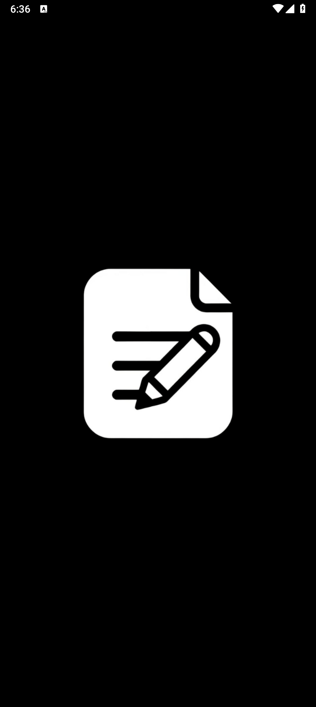  
  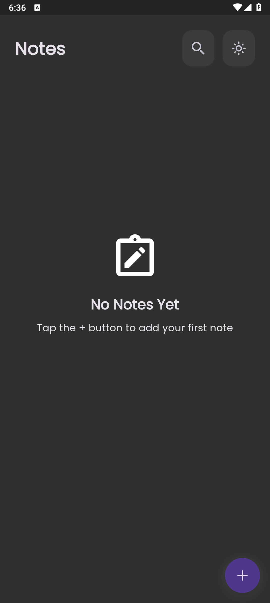  
  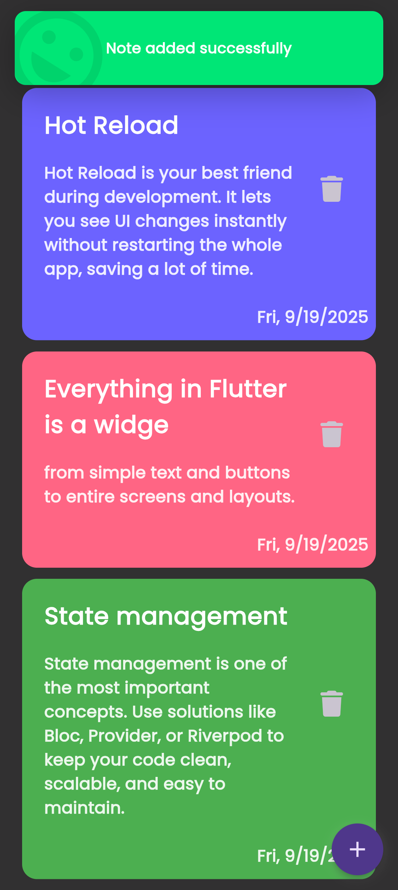  
  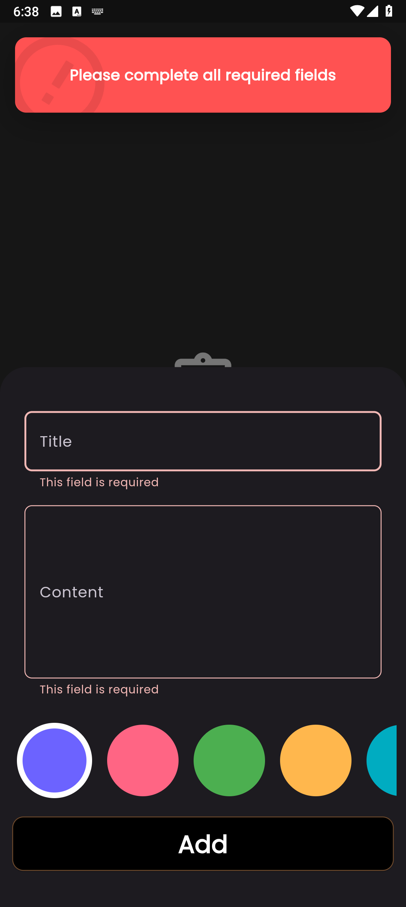  
  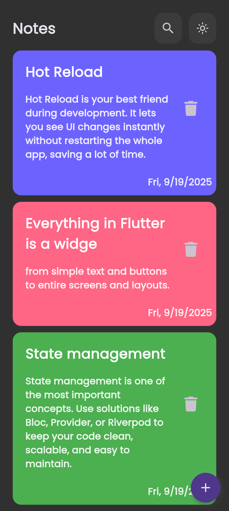  
  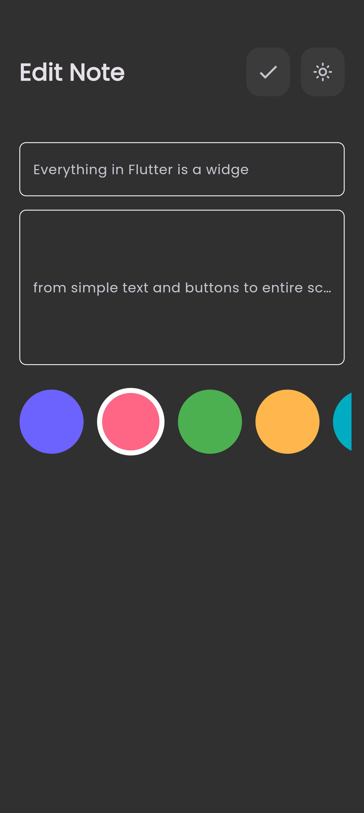  
  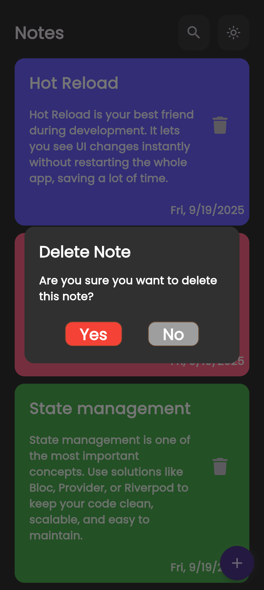  
</p>  

---
###  Light Mode  
<p align="center">  
  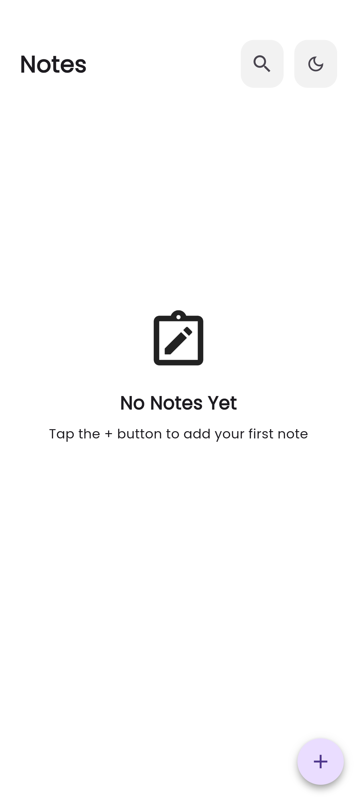  
  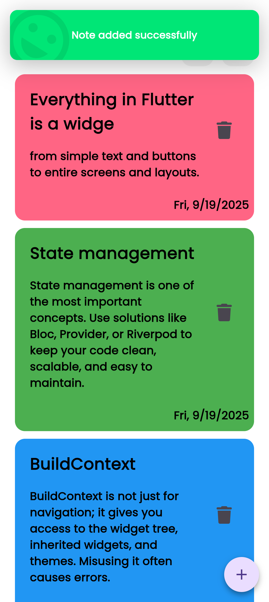  
  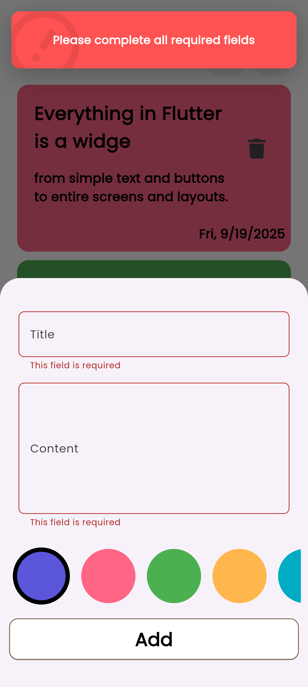  
  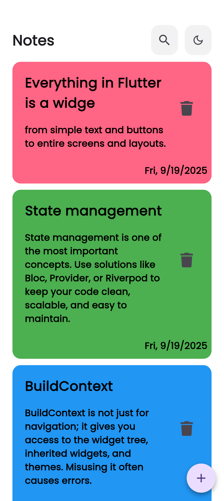  
  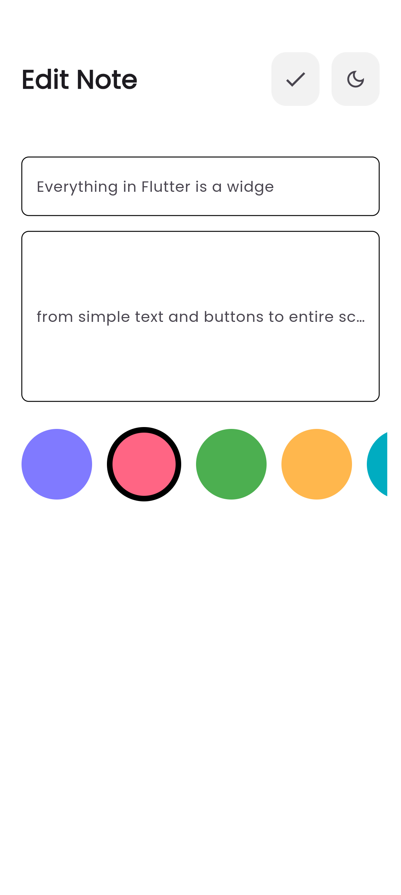  
  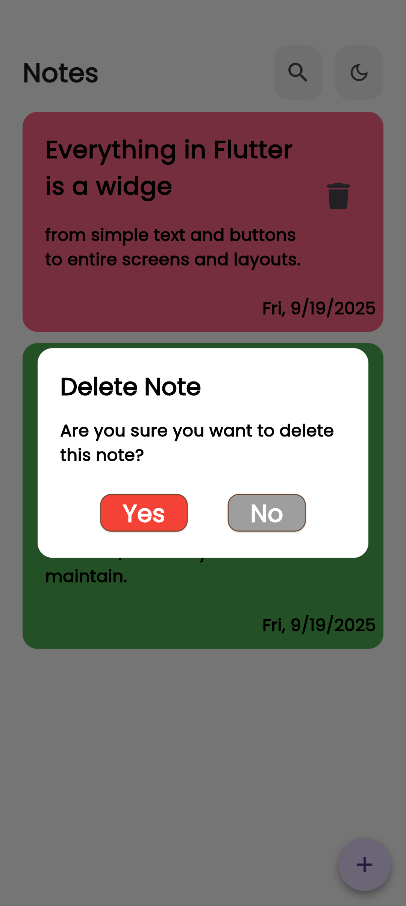  
</p>  

## Technical Overview

- **Framework:** Flutter
- **State Management:** `flutter_bloc` (using Cubit) for predictable and scalable state management.
- **Database:** `hive` for a lightweight and fast NoSQL local database.
- **Architecture:** The project follows a feature-first architecture, separating concerns into distinct feature modules (e.g., `notes`, `splash`).
- **Code Generation:** `hive_generator` and `build_runner` are used to generate the necessary type adapters for Hive models.

## Getting Started

To get a local copy up and running, follow these simple steps.

### Prerequisites

- Flutter SDK installed on your machine. You can find instructions [here](https://docs.flutter.dev/get-started/install).

### Installation

1.  **Clone the repository:**
    ```sh
    git clone https://github.com/OmarGamalDev/notes-app.git
    ```
2.  **Navigate to the project directory:**
    ```sh
    cd notes-app
    ```
3.  **Install dependencies:**
    ```sh
    flutter pub get
    ```
4.  **Run the build runner** to generate Hive type adapters:
    ```sh
    flutter pub run build_runner build --delete-conflicting-outputs
    ```
5.  **Run the app:**
    ```sh
    flutter run
    ```

## Project Structure

The project is organized using a feature-driven approach to keep the codebase modular and maintainable.

```
lib/
├── core/                  # Shared components and utilities
│   ├── constants/         # App-wide constants (colors, styles, routes)
│   ├── shared_widgets/    # Reusable widgets (buttons, text fields)
│   └── theme/             # Theme management (ThemeCubit)
│
├── features/              # Application features
│   ├── notes/             # Notes feature module
│   │   ├── data/
│   │   │   └── models/    # Data models (NoteModel)
│   │   └── presentation/
│   │       ├── cubit/     # BLoC logic for notes
│   │       ├── views/     # UI screens for the notes feature
│   │       └── widgets/   # Widgets specific to the notes feature
│   └── splash/            # Splash screen feature
│
└── main.dart              # Main application entry point